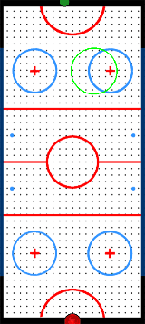

# 2D Air Hockey Simulator (Box2D Engine)

This contains an air hockey simulation environment powered by Box2D. It is fast (C++ back-end), capable of self-play, 1v1 play, and easy goal-conditioned reinforcement learning, resulting in a rich testbed for various algorithms.

Policy Trained for Upward Puck Velocity |  Goal-Conditioned RL
:-------------------------:|:-------------------------:
  |  

## Installation (if you also want to run training scripts):
- `pip install -e .[train]`

## How to Run
Most of the files use a configuration file (--cfg cmd argument), but is defaulted to one from `configs/`. Please see there to tune parameters for various scripts.
#### What the files do
- `airhockey2d.py`: base gym environment for air hockey
- `render.py`: renders the air hockey environment
- `train.py`: trains an agent via stable-baselines3 PPO.

Legacy:
- `demonstrate.py`: user plays a self-play air hockey environment using keyboard
- `play_trained_agent`: run after training, you can play against the trained agent
