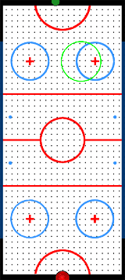

# Air Hockey Reinforcement Learning Environment

This contains an air hockey simulation environment powered by Box2D. It is fast (C++ back-end), capable of self-play, 1v1 play, and easy goal-conditioned reinforcement learning, resulting in a rich testbed for various algorithms.


Policy Trained for Upward Puck Velocity |  Goal-Conditioned RL
:-------------------------:|:-------------------------:
  |  

## Installation

### Using uv
```bash
# Install uv if you haven't already
curl -LsSf https://astral.sh/uv/install.sh | sh
```

#### Option A: sync with lock file
```bash
# Create virtual environment and sync dependencies from lock file
uv sync
# For training dependencies
uv sync --extra train
```

#### Option B: Install directly
```bash
# create uv virtual environment and activate
uv venv
source .venv/bin/activate

# Install the package in development mode
uv pip install -e .

# Or if you need training too:
uv pip install -e ".[train]"
```

### Using pip (legacy)
```bash
# Install with training dependencies
pip install -e .[train]

# Or just the base package
pip install -e .
```


## Other

- Project notes and formal docs (architecture, Cursor rule mirrors): [`notes/docs/index.md`](notes/docs/index.md)

#### Having this issue?
AttributeError: 'MjRenderContextOffscreen' object has no attribute 'con'
`echo 'export MUJOCO_GL="glx"' >> ~/.bashrc`
`source ~/.bashrc`

## How to Run
Most of the files use a configuration file (--cfg cmd argument), but is defaulted to one from `configs/`. Please see there to tune parameters for various scripts.
#### What the files do
- `airhockey2d.py`: base gym environment for air hockey
- `render.py`: renders the air hockey environment
- `train.py`: trains an agent via stable-baselines3 PPO.

Legacy:
- `demonstrate.py`: user plays a self-play air hockey environment using keyboard
- `play_trained_agent`: run after training, you can play against the trained agent

## Running on the Physical UR5
- Boot up the robot through the touchpad
    - Press physical power button
    - Press red power on touchpad in bottom left corner
    - power on the robot with touch button in the middle
    - open program "external_control.urp"
- run desired script in scripts/real
    - ex: python scripts/real/teleoperate.py --cfg configs/baseline_configs/puck_vel_real.yaml
- When prompted in the terminal, run the program using the play button in the bottom middle of the touchpad
- follow prompts on the terminal. Hold 'q' to end trajectories 