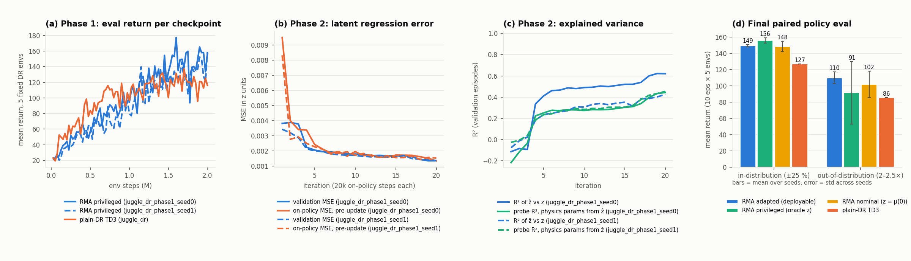

# RMA (Rapid Motor Adaptation) baseline with TD3 on the canonical ±25 % physics DR — latent fit and policy performance

- **Date**: 2026-09-11 01:05 UTC start
- **Status**: done (2 phase-1 seeds × 2M steps, 2 phase-2 runs × 400k on-policy steps, one 40-iteration / 800k phase-2 variant in the addendum)
- **Run dirs**: `runs/rma/juggle_dr_phase1_seed{0,1}` (phase 1), `runs/rma/juggle_dr_phase1_seed{0,1}/phase2` (phase 2), `runs/rma/juggle_dr_phase1_seed0/phase2_long` (40 iterations, 800k-step dataset); baseline `runs/td3/tasks_20260904/dr/juggle_dr` (plain DR TD3, 2026-09-04, hist2, same sim config / recipe / eval seed, single seed)
- **Configs**: `configs/rma/rma_juggle_dr_phase1.yaml`, `configs/rma/rma_juggle_dr_phase2.yaml`; sim `configs/new_juggle/zeroshot_ablations/sim_paramrand_pm25.yaml`
- **Code**: `scripts/rma/` — design + the TD3-instead-of-PPO assessment in `notes/docs/training/rma-baseline.md`
- **Assets**: [`2026-09-11_01-05_rma-td3-baseline-assets/`](2026-09-11_01-05_rma-td3-baseline-assets/) — `rma_results.png` (figure), `summary.md` (full tables from `scripts/rma/summarize.py`), `latent_usage_seed{0,1}.csv`

## Question

Does an explicit-adaptation baseline (RMA: privileged latent z = μ(e) trained
with the policy, then a supervised adaptation module φ that infers ẑ from the
50-step state/action history) beat, match or trail the paper's implicit
scheme (plain TD3 on the same ±25 % physics randomization, which must infer the
dynamics from its 5-frame observation history) on the canonical juggle task,
and how well does φ actually recover the latent / the physics parameters?

## Setup

Both schemes: `sim_paramrand_pm25.yaml` (hist_len 2, paddle_density /
puck_damping / gravity uniform ±25 % per reset, obs delay + puck noise +
occlusion on), the juggle-DR TD3 recipe (`configs/td3/tasks/juggle_dr.yaml`
values: 2M steps, q = 25 / actor = 6 per episode, PER, single flat 1M buffer,
`q_weight_decay 0`, 64-wide actor / critic), fixed 5-env eval set
(`eval_param_seed 12345`).

RMA phase 1 adds μ (256-128 → 8-dim z) into the actor and gives the critic the
raw normalised e_t; phase 2 = 20 iterations × 20k on-policy env steps, φ =
per-step MLP → 3 × Conv1d over H = 50 → 8, Adam 5e-4, 4 epochs / iteration,
10 % of episodes held out. Final paired eval: 5 ID envs + 5 OOD envs
(`random_variable_ranges_OOD`: physics 2–2.5× sysid), 10 episodes per env,
identical episode seeds for every agent. Wall clock: phase 1 ≈ 95 min per seed
(two jobs sharing the box, ~350 SPS), phase 2 ≈ 14 min.

Agents in the final eval: **adapted** (deployable RMA, ẑ from φ),
**privileged** (oracle z = μ(e), sim-only upper bound), **nominal** (z = μ(0),
RMA without adaptation), **td3_dr** (the on-disk plain-DR policy).

## Results

### Phase 1 — privileged RMA policy vs plain-DR TD3 (same 5 eval envs, 4 eps each per checkpoint)

| Run | 250k | 500k | 750k | 1M | 1.25M | 1.5M | 1.75M | 2M (final) | back-half mean (1M–2M, 40 ckpts) | max |
|---|---:|---:|---:|---:|---:|---:|---:|---:|---:|---:|
| RMA privileged seed 0 | 52.0 | 57.2 | 91.1 | 94.5 | 138.2 | 133.1 | 159.8 | 156.3 | 133.6 | 177.4 |
| RMA privileged seed 1 | 37.8 | 65.1 | 70.2 | 79.8 | 93.6 | 122.6 | 104.4 | 158.9 | 121.9 | 158.9 |
| plain-DR TD3 (seed 0) | 53.8 | 83.8 | 110.2 | 97.0 | 118.5 | 100.3 | 119.9 | 116.0 | 117.3 | 137.2 |

Per-checkpoint values are 20-episode means and jump by ±20 between adjacent
checkpoints (see the figure); the trajectory shape is: RMA is *slower* for the
first ~1M steps (below the baseline at every 250k mark) and then keeps climbing
while the baseline plateaus at ~117 from 1M on. The back-half means are 134 /
122 vs 117; the RMA seeds differ by 12 between themselves, so the phase-1 gap
to the (single-seed) baseline is of the order of one seed-to-seed spread and
should be read as "at least as good, probably better", not as a measured
+15.

**How much does the base policy use the latent?** (`scripts/rma/analyze_latent_usage.py`; z spread = std of μ(e) over the DR box, action shift = mean |π(x, μ(e)) − π(x, μ(0))| on 2000 states visited by the final policy)

| step | 25k | 250k | 500k | 1M | 1.5M | 2M |
|---|---:|---:|---:|---:|---:|---:|
| z spread, seed 0 / 1 | 0.37 / 0.41 | 0.23 / 0.31 | 0.15 / 0.14 | 0.08 / 0.08 | 0.07 / 0.05 | 0.06 / 0.05 |
| action shift as % of mean \|a\|, seed 0 / 1 | 21 / 33 | 32 / 51 | 29 / 29 | 17 / 16 | 12 / 7 | 12 / 9 |

The latent stays informative about e (a linear probe from the true z recovers
all three parameters with R² 0.999 at every checkpoint) but the policy's
dependence on it shrinks monotonically through training: from a third to a
half of the action magnitude at 250k to ~10 % at 2M. The base policy converges
most of the way to a dynamics-agnostic (robust) controller — the ±25 % range
is narrow enough that one policy nearly covers it — which caps what phase 2 can
add in-distribution (see the nominal agent below).

### Phase 2 — adaptation-module fit (validation = held-out episodes of the same on-policy rollouts)

| iter (20k steps each) | 1 | 5 | 10 | 15 | 20 |
|---|---:|---:|---:|---:|---:|
| val MSE, seed 0 / 1 | 0.0038 / 0.0034 | 0.0020 / 0.0020 | 0.0018 / 0.0017 | 0.0017 / 0.0016 | 0.0013 / 0.0013 |
| val R² of ẑ vs z (mean over 8 dims), seed 0 / 1 | −0.12 / −0.08 | 0.41 / 0.24 | 0.49 / 0.31 | 0.52 / 0.35 | **0.62 / 0.43** |
| probe R² (physics params from ẑ), seed 0 / 1 | −0.22 / −0.03 | 0.25 / 0.23 | 0.27 / 0.28 | 0.30 / 0.31 | **0.44 / 0.45** |
| on-policy MSE before the update, seed 0 / 1 | 0.0095 / 0.0083 | 0.0024 / 0.0023 | 0.0019 / 0.0017 | 0.0017 / 0.0016 | 0.0013 / 0.0015 |

- **Target scale.** The regression targets have variance 0.0036 / 0.0026 per
  latent dim (the shrunken z above), so absolute MSEs are tiny; R² is the
  number to read. After 400k steps φ explains 62 % / 43 % of the latent
  variance and is still improving at iteration 20 (data-limited; the fit is
  steady from iteration 5 to 15 while the rolling dataset fills, then rises
  again once it is full — see the addendum for 40 iterations).
- **Which parameters are identifiable from 50 steps of paddle/puck history?**
  Per-parameter probe R² at iteration 20: **paddle_density 0.94 / 0.92**,
  gravity 0.34 / 0.44, **puck_damping 0.06 / 0.01**. Paddle mass shows up
  immediately in how the paddle answers its commands; gravity is only
  visible while the puck is in free flight (and the puck history is delayed,
  noisy and occluded); ±25 % of a damping of 0.18 changes the puck speed by
  ~1 % per step and is not recoverable from one episode.
- **Speed of adaptation.** Validation MSE by steps since reset (seed 0 / 1):
  t < 10: 0.0030 / 0.0023; 10–25: 0.0017 / 0.0017; 25–50: 0.0012 / 0.0013;
  ≥ 50: 0.0012 / 0.0013 — the estimate converges within ~25 control steps,
  i.e. well inside the 50-step window.
- **No on-policy distribution shift.** The pre-update MSE on each iteration's
  fresh rollouts equals the validation MSE from iteration 4 on (0.0013 vs
  0.0013 at the end), so the deterministic TD3 rollouts did not produce a
  train/deploy gap; `rollout_action_noise` was not needed.
- Rollout returns during phase 2 stayed at 130–157 (the adapted policy is
  the one collecting the data), i.e. the base policy is never destabilised by
  the early, untrained ẑ.

### Final paired policy evaluation (10 episodes × 5 envs per split, same episode seeds for every agent; ± = SEM over the 50 episodes)

| agent | ID seed 0 | ID seed 1 | OOD seed 0 | OOD seed 1 |
|---|---:|---:|---:|---:|
| **RMA adapted** (deployable) | 150.7 ± 5.9 | 147.7 ± 7.1 | 102.7 ± 7.7 | 117.2 ± 6.5 |
| RMA privileged (oracle z) | 159.1 ± 5.7 | 152.4 ± 6.1 | 129.7 ± 8.5 | 53.0 ± 4.6 |
| RMA nominal (z = μ(0)) | 154.7 ± 6.6 | 142.2 ± 7.1 | 85.4 ± 6.4 | 117.9 ± 6.9 |
| plain-DR TD3 (single seed) | 127.0 ± 6.3 | 127.0 ± 6.3 | 85.5 ± 6.0 | 85.5 ± 6.0 |

Success rate (puck juggled at least once) is 0.98–1.00 for every agent ID;
OOD it is 0.86–0.96 for adapted, 0.88–0.98 nominal, 0.90 td3_dr, and 0.92 /
0.64 privileged. Online latent MSE of the adapted agent during the eval:
0.0015 / 0.0014 ID (= validation), 0.026 / 0.10 OOD (the OOD physics maps to
e outside [-1, 1]; φ's estimate stays near the training range while the
oracle z extrapolates).

- **In distribution**: adapted 151 / 148 ≈ privileged 159 / 152 ≈ nominal
  155 / 142 — within one to two SEMs of each other in both seeds. The RMA
  policies beat the plain-DR policy by ~20–30 (three to four SEMs, paired
  episodes), but that gap is the *phase-1* gap (asymmetric critic + latent
  during training), not adaptation at test time: the nominal agent, which
  never adapts, is already there.
- **Out of distribution** the picture is seed-dependent. Seed 0: adapted 103
  > nominal 85 = td3_dr 86, privileged 130 — here the latent matters and φ
  recovers about half of the oracle's gain. Seed 1: adapted 117 = nominal 118
  > td3_dr 86, privileged 53 — the oracle latent, fed physics 2–2.5× outside
  the training box, drives the policy off a cliff, while φ (whose outputs are
  bounded by what it has seen) does not. Adapted RMA beat plain DR by +17 /
  +32 OOD in both seeds.

## Conclusion

1. **The RMA baseline is implemented canonically and works end to end**
   (phase 1 → phase 2 → deployable φ + π), with TD3 as the phase-1 learner.
   Phase-2 on-policy regression converges without a train/deploy gap, so the
   deterministic actor is not a problem in practice for this task.
2. **In distribution RMA is a wash over plain DR at test time.** The base
   policy learns to nearly ignore its privileged latent (action sensitivity
   ~10 % by 2M steps), so adapted ≈ nominal ≈ privileged; the ±25 % range is
   small enough for one robust policy. The ~25-point gain of every RMA agent
   over the plain-DR policy comes from phase-1 training (asymmetric critic
   and/or the latent while it still mattered), and rests on one baseline seed
   against two RMA seeds that themselves differ by 12 in back-half mean.
3. **Out of distribution the adaptation module is useful and safer than the
   oracle**: +17 / +32 over plain DR, and it avoids the oracle's collapse in
   seed 1. Single seed per cell on the OOD side of the story; the two seeds
   disagree on whether adaptation beats nominal.
4. **Latent fit**: R² 0.62 / 0.43 after 400k steps and still rising; paddle
   mass is identified almost perfectly, gravity partially, puck damping not
   at all from a 50-step window. Adaptation converges within ~25 steps.
5. For the paper, RMA can be reported as a baseline that matches or slightly
   exceeds the parameter-randomization scheme in sim; whether the explicit
   adaptation transfers better to the robot is untested (no real-robot agent
   wired yet; see `rma-baseline.md`).

## Next

- Wire `AdaptedRMAAgent` into `async_td3_real_eval.py --agent rma` and run the
  real-robot paired eval next to the plain-DR policy (the actual paper number).
- More phase-1 seeds for both schemes (the ID gap is one-seed-baseline
  territory) and a plain-DR seed 1 on the same eval seeds.
- A wider DR range (±50 %) is where RMA should separate from plain DR (the
  base policy would have to use z); cheap to test with the same code.
- Phase-2 data budget: run to saturation (addendum) and try `full_obs` step
  features.

## Addendum — 40-iteration phase 2 (seed 0, 800k-step rolling dataset)

`runs/rma/juggle_dr_phase1_seed0/phase2_long` (same phase-1 policy, `--n-iterations 40 --dataset-max-steps 800000`, 728k train + 80k validation steps at the end, 30 min).

| iter (20k steps each) | 10 | 20 | 25 | 30 | 35 | 40 |
|---|---:|---:|---:|---:|---:|---:|
| val MSE | 0.0018 | 0.0013 | 0.0012 | 0.0011 | 0.0011 | 0.0011 |
| val R² of ẑ vs z | 0.50 | 0.64 | 0.68 | 0.69 | 0.71 | **0.71** |
| probe R², mean (density / damping / gravity) | 0.31 (0.91 / 0.00 / 0.02) | 0.48 (0.94 / 0.10 / 0.41) | 0.52 (0.94 / 0.11 / 0.50) | 0.55 (0.95 / 0.15 / 0.54) | 0.57 (0.95 / 0.19 / 0.56) | **0.57 (0.95 / 0.19 / 0.58)** |
| val MSE t < 10 / t ≥ 50 | 0.0036 / 0.0017 | 0.0031 / 0.0012 | 0.0030 / 0.0010 | 0.0029 / 0.0010 | 0.0029 / 0.0009 | 0.0028 / 0.0009 |

- The fit saturates around R² 0.7 (latent) / 0.57 (parameters) after
  ~600k steps: paddle mass 0.95, gravity 0.58, puck damping 0.19. Gravity
  keeps improving with data (0.02 → 0.58); damping stays mostly
  unidentifiable from a 50-step window. Late-episode error (t ≥ 50) keeps
  falling while the first-10-step error does not — the module cannot do
  much before the paddle has moved and the puck has flown.
- Final paired eval (different episode seeds than the 20-iteration run,
  `call_index` 41): ID adapted 149.0 ± 6.3, privileged 149.2 ± 5.8, nominal
  159.2 ± 5.6, td3_dr 111.7 ± 6.2; OOD adapted 108.8 ± 7.4, privileged
  126.4 ± 7.3, nominal 102.5 ± 6.8, td3_dr 95.7 ± 7.1. Same ordering as
  before: ID a wash between the three RMA agents, all above plain DR; OOD
  adapted > nominal > plain DR, privileged highest for this seed.
- **Eval-noise calibration.** The *same* plain-DR policy scored 127.0 ± 6.3
  (ID) / 85.5 ± 6.0 (OOD) on the earlier 50-episode draw and 111.7 ± 6.2 /
  95.7 ± 7.1 on this one, i.e. two to three SEMs apart purely from episode
  seeds. Differences below ~15–20 return between agents in these tables are
  not resolvable with 50 paired episodes; the paired design cancels the
  episode-seed component within a table but not across tables.
