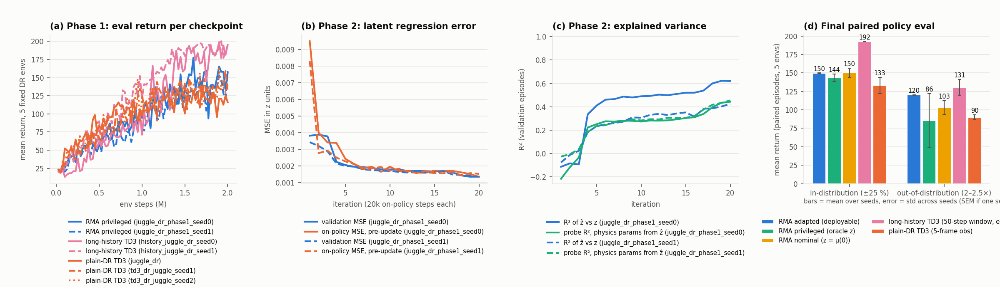

# RMA vs fair baselines: long-history TD3 control (same 50-step window, no privileged latent) and two more plain-DR seeds

- **Date**: 2026-09-18 21:00 UTC start (runs launched ~21:00 UTC, paired eval 22:45 UTC)
- **Status**: done
- **Supersedes** (the policy comparison of): [`2026-09-11_01-05_rma-td3-baseline.md`](2026-09-11_01-05_rma-td3-baseline.md) — its latent-fit results stand; its "RMA ≈ 25 above plain DR" conclusion does not
- **Run dirs**: new `runs/rma/history_juggle_dr_seed{0,1}` (long-history control, `rma_mode: history`), `runs/rma/td3_dr_juggle_seed{1,2}` (plain DR, `td3_training_dr`, same hist2 pm25 sim config as the on-disk seed 0 `runs/td3/tasks_20260904/dr/juggle_dr`); reused `runs/rma/juggle_dr_phase1_seed{0,1}` + `/phase2` (RMA); paired eval `runs/rma/paired_eval/`
- **Configs**: `configs/rma/history_juggle_dr.yaml` (new), `configs/rma/rma_juggle_dr_phase{1,2}.yaml`, `configs/td3/tasks/juggle_dr.yaml` with `--config configs/new_juggle/zeroshot_ablations/sim_paramrand_pm25.yaml`
- **Code**: `scripts/rma/` — `HistoryActor` / `HistoryEnvVector` / `rma_mode: history` in `train_base_policy.py`, `eval_paired.py` (new); design in `notes/docs/training/rma-baseline.md` §"The fair control"
- **Assets**: [`2026-09-18_21-00_rma-fair-baselines-long-history-control-assets/`](2026-09-18_21-00_rma-fair-baselines-long-history-control-assets/) — `paired_eval.md/.json`, `paired_eval_ood.json`, `summary_phase1_all.md`, `rma_results.png`

## Question

The 2026-09-11 comparison put RMA (deployable policy = 50-step state/action
window → adaptation module → z → π) against a plain-DR TD3 policy that sees only
the 5-frame observation, and against a single baseline seed. Two confounds:
(1) RMA has 10× more history than the baseline; (2) one seed. Is the RMA
advantage the supervised privileged latent, or just the longer window (or
noise)?

## Setup

Everything as in the 2026-09-11 note (sim `sim_paramrand_pm25.yaml`, ±25 %
physics DR, hist2, juggle-DR TD3 recipe, 2M steps, fixed 5-env eval set
`eval_param_seed 12345`). New:

- **Long-history TD3 control** (`rma_mode: history`, 2 seeds): the deployable
  RMA architecture — the same 50 × 8 window of (paddle x, y, valid; puck x, y,
  valid; action) → the same conv encoder (32-dim embed, Conv1d 32 ch,
  kernels 8/5/5, strides 4/1/1) → 8-dim z → the same 64-wide trunk — trained
  **end-to-end by the TD3 actor loss with no privileged input**; the critic
  sees `[x_t, window]`. RMA's only remaining difference to it is that RMA's z is
  supervised to μ(e) instead of learned by RL.
- **Plain-DR TD3** seeds 1 and 2 on exactly the seed-0 baseline's config.
- **Paired evaluation** (`scripts/rma/eval_paired.py`): all eleven policies
  on the same 5 ID envs and 5 OOD envs (`random_variable_ranges_OOD`, physics
  2–2.5× sysid), **20 episodes per env, identical episode seeds for every
  agent** (`call_index 1000`, a fresh draw disjoint from every previous eval).
  ± = SEM over the 100 episodes per split.

Return scale: +1 per step with the puck in the upper half, 250-step episodes,
so 250 is the ceiling; an episode ends early when the puck passes the paddle.

## Results

### Phase-1 / training curves (fixed 5 envs × 4 episodes per checkpoint)

| Run | 250k | 500k | 750k | 1M | 1.25M | 1.5M | 1.75M | 2M (final) | back-half mean | max |
|---|---:|---:|---:|---:|---:|---:|---:|---:|---:|---:|
| RMA privileged seed 0 | 52.0 | 57.2 | 91.1 | 94.5 | 138.2 | 133.1 | 159.8 | 156.3 | 133.6 | 177.4 |
| RMA privileged seed 1 | 37.8 | 65.1 | 70.2 | 79.8 | 93.6 | 122.6 | 104.4 | 158.9 | 121.9 | 158.9 |
| **long-history TD3 seed 0** | 38.8 | 61.4 | 70.3 | 71.2 | 145.8 | 161.4 | 144.8 | **195.2** | 159.6 | 199.1 |
| **long-history TD3 seed 1** | 56.6 | 89.9 | 89.5 | 121.5 | 157.8 | 179.9 | 190.9 | **194.6** | 178.1 | 200.2 |
| plain-DR TD3 seed 0 (2026-09-04) | 53.8 | 83.8 | 110.2 | 97.0 | 118.5 | 100.3 | 119.9 | 116.0 | 117.3 | 137.2 |
| plain-DR TD3 seed 1 | 53.8 | 66.8 | 85.1 | 129.5 | 120.4 | 141.8 | 128.6 | 132.2 | 130.2 | 158.9 |
| plain-DR TD3 seed 2 | 54.8 | 77.5 | 90.0 | 122.5 | 124.8 | 118.8 | 138.0 | 139.8 | 125.4 | 162.7 |

The long-history control learns as slowly as RMA for the first ~1M steps and
then climbs to ~195, close to the 250 ceiling; plain DR plateaus at 115–140;
RMA's privileged policy ends at ~157.

### Paired evaluation (20 episodes × 5 envs per split, same episode seeds for all agents)

| agent | ID return ± SEM | ID success | ID ep len | OOD return ± SEM | OOD success | OOD ep len |
|---|---:|---:|---:|---:|---:|---:|
| RMA adapted seed 0 | 149.0 ± 4.1 | 1.00 | 212 | 120.0 ± 5.6 | 0.91 | 172 |
| RMA adapted seed 1 | 150.0 ± 4.7 | 0.97 | 213 | 120.3 ± 5.5 | 0.95 | 178 |
| RMA privileged seed 0 | 148.6 ± 4.5 | 0.99 | 212 | 121.9 ± 6.2 | 0.89 | 175 |
| RMA privileged seed 1 | 138.5 ± 4.7 | 0.98 | 198 | 49.2 ± 3.0 | 0.66 | 88 |
| RMA nominal seed 0 | 156.6 ± 4.4 | 0.98 | 220 | 94.1 ± 5.0 | 0.84 | 144 |
| RMA nominal seed 1 | 143.9 ± 4.4 | 0.98 | 208 | 112.7 ± 4.5 | 0.97 | 169 |
| **long-history TD3 seed 0** | **192.5 ± 1.7** | 1.00 | 250 | **141.3 ± 5.8** | 0.93 | 199 |
| **long-history TD3 seed 1** | **192.5 ± 2.1** | 1.00 | 249 | 119.9 ± 5.8 | 0.92 | 171 |
| plain-DR TD3 seed 0 | 125.1 ± 5.0 | 0.97 | 181 | 87.6 ± 4.8 | 0.88 | 140 |
| plain-DR TD3 seed 1 | 148.7 ± 4.0 | 1.00 | 213 | 88.3 ± 4.8 | 0.88 | 140 |
| plain-DR TD3 seed 2 | 125.9 ± 4.7 | 0.99 | 185 | 94.6 ± 5.0 | 0.89 | 145 |

| kind (mean over seeds, ± std across seeds) | n | ID return | OOD return |
|---|---:|---:|---:|
| long-history TD3 (50-step window, end-to-end) | 2 | **192.5 ± 0.0** | **130.6 ± 10.7** |
| RMA adapted (deployable) | 2 | 149.5 ± 0.5 | 120.1 ± 0.2 |
| RMA nominal (z = μ(0)) | 2 | 150.2 ± 6.3 | 103.4 ± 9.3 |
| RMA privileged (oracle z) | 2 | 143.6 ± 5.0 | 85.6 ± 36.3 |
| plain-DR TD3 (5-frame obs) | 3 | 133.2 ± 11.0 | 90.2 ± 3.1 |

- **The long-history control beats RMA by ~43 return in distribution** (192.5
  vs 149.5, every episode runs to the 250-step limit, SEM ≈ 2), and by ~10 out
  of distribution (131 vs 120, within the seed spread). Same inputs, same
  network, same recipe; the only difference is that its 8-dim z is learned by
  RL instead of regressed to the privileged encoder's output.
- **RMA vs plain DR shrinks to ~16 in distribution** (149.5 vs 133.2 ± 11
  over three seeds) once the baseline has more than one seed; plain-DR seed 1
  (148.7) matches RMA adapted. Out of distribution RMA adapted keeps ~30 over
  plain DR (120 vs 90) and is very consistent across its two seeds (120.0 /
  120.3), while the long-history control is the best OOD policy in one seed
  (141) and equal to RMA in the other (120).
- **Within RMA, adapted ≈ nominal ≈ privileged in distribution** again
  (149.5 / 150.2 / 143.6): the base policy still nearly ignores z (see the
  2026-09-11 note's latent-usage analysis). OOD, adapted is the most reliable
  of the three (nominal 94 / 113, privileged 122 / 49): φ's bounded estimate
  is safer than the oracle latent extrapolated 2–2.5× outside the training
  box.
- Eval noise calibration: plain-DR seed 0 scored 125.1 here vs 127.0 and
  111.7 on the two earlier 50-episode draws; with 100 paired episodes per
  split the SEMs are 2–6 and the seed-to-seed spread (11 for plain DR) is the
  larger uncertainty.

## Conclusion

1. **The RMA baseline's apparent gain over plain DR was mostly the longer
   history, not the privileged latent.** Given the same 50-step window and
   the same encoder, TD3 trained end-to-end reaches 192 vs RMA's 150 in
   distribution and is at least as good out of distribution.
2. **RMA's supervised bottleneck is the limiting factor here.** Phase 1
   learns a base policy that barely uses the 8-dim z (±25 % DR is narrow
   enough for a near-robust policy), so phase 2 has little to transfer; the
   end-to-end control instead lets the window carry whatever the critic finds
   useful — puck trajectory information well beyond "which physics
   parameters", judging by the 40-point gap.
3. **For the paper**: the honest table has three sim2sim rows — plain DR
   (5-frame obs) 133 ± 11, RMA (deployable) 150 ± 1, long-history TD3 193 ± 0
   (2–3 seeds each, same envs and episode seeds; OOD 90 / 120 / 131). RMA
   should be reported as "explicit adaptation baseline; matches its own
   privileged oracle but is dominated by an end-to-end policy with the same
   history". Whether the same ordering holds on the real robot is untested.
4. The long-history control is also the strongest sim policy produced so
   far on this task (192 of 250 on the DR eval set); it is a candidate
   source policy for sim2real, subject to its 430-dim critic input and
   50-step warm-up being acceptable on the robot.

## Next

- Real-robot paired eval of plain DR / RMA adapted / long-history (the
  paper number); wire `HistoryAgent` and `AdaptedRMAAgent` into
  `async_td3_real_eval.py --agent`.
- A wider DR range (±50 %) is where the privileged latent should start to
  matter; rerun the three rows there.
- A third seed for RMA and the long-history control.
